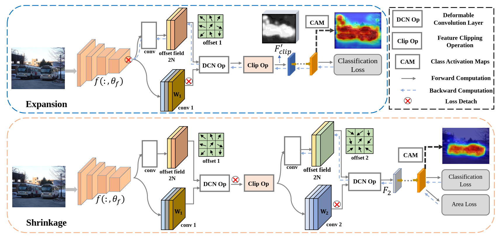

# Official code for our paper “Expansion and Shrinkage of Localization for Weakly-Supervised Semantic Segmentation” (NeurIPS 2022)

## Abstract
Generating precise class-aware pseudo ground-truths, a.k.a, class activation maps (CAMs), is essential for weakly-supervised semantic segmentation. The original CAM method usually produces incomplete and inaccurate localization maps. To tackle with this issue, this paper proposes an Expansion and Shrinkage scheme based on the offset learning in the deformable convolution, to sequentially improve the recall and precision of the located object in the two respective stages. In the Expansion stage, an offset learning branch in a deformable convolution layer, referred as “expansion sampler” seeks for sampling increasingly less discriminative object regions，driven by an inverse supervision signal that maximizes image-level classification loss. The located more complete object in the Expansion stage is then gradually narrowed down to the final object region during the Shrinkage stage. In the Shrinkage stage, the offset learning branch of another deformable convolution layer, referred as “shrinkage sampler”, is introduced to exclude the false positive background regions attended in the Expansion stage to improve the precision of the localization maps. We conduct various experiments on PASCAL VOC 2012 and MS COCO 2014 to well demonstrate the superiority of our method over other state-ofthe-art methods for weakly-supervised semantic segmentation. 

The implementation of “Expansion and Shrinkage of Localization for Weakly-Supervised Semantic Segmentation” (ESOL_WSSS), Jinlong Li, Zequn Jie, Xu Wang, Xiaolin Wei, Lin Ma.

Code will be made publicly available soon.
